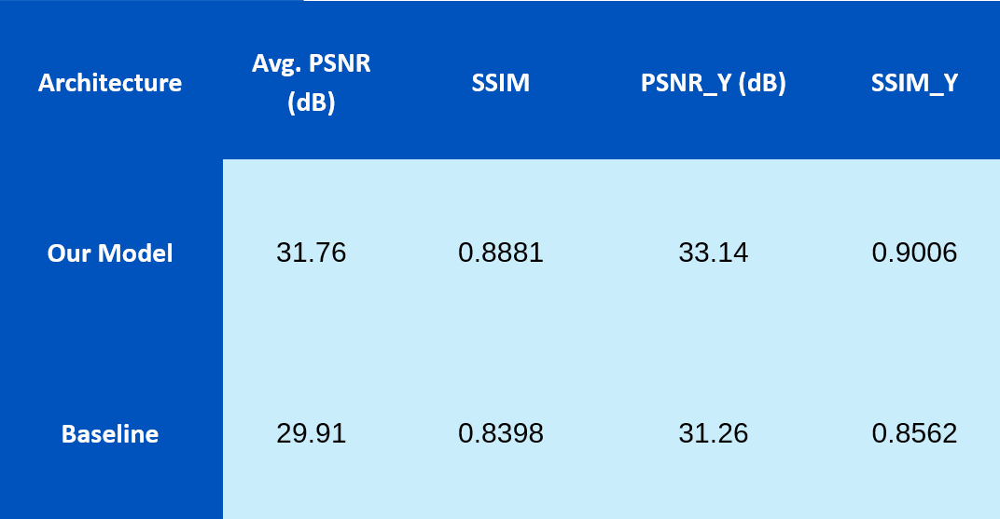
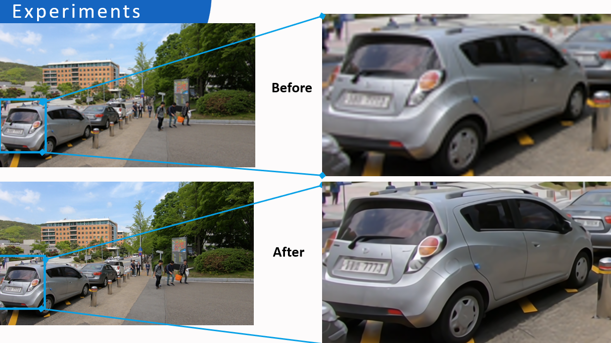

# AI Video & Audio Enhancement Platform

A full-stack web application that empowers users to enhance low-quality videos with super-resolution and synchronized audio denoising. Built on a modern React frontend and Flask backend, the platform streamlines every step—from user registration to media upload, AI-driven processing, and final download of restored outputs.

---

## 📑 Table of Contents

- [Demo](#-demo)
- [Technologies Used](#-technologies-used)
- [System Architecture](#-system-architecture)
- [Model Architectures](#-model-architectures)
- [Detailed Results](#-detailed-results)
- [Getting Started](#-getting-started)
- [Contributing](#-contributing)
- [License](#-license)

---

## 🎥 Demo

<video width="640" controls>
  <source src="Media/Demo.mp4" type="video/mp4" />
  Your browser does not support the video tag.
</video>

---

## 🛠️ Technologies Used

- **Frontend**: **React** framework for video upload, progress tracking, and result visualization.
- **Backend**: **Java Spring Boot** RESTful API handling user management, authentication, and business logic.
- **AI Endpoints**: **Flask** REST APIs exposing RVRT and Demucs models for inference.
- **PyTorch & NumPy**: Core libraries for custom RVRT implementation and tensor manipulations.

---

## 🏗️ System Architecture


1. **Application Layer**

   - **React Frontend**: Handles user registration/login, video upload interface, and download of enhanced media.
   - **Flask API**: Validates requests, manages user sessions, and enqueues processing jobs.

2. **Model Layer**

   - **Video-to-Frames**: Extracts individual frames from uploaded video clips.
   - **Modified RVRT**: Applies a recurrent Transformer enhanced with 3D convolutional residual blocks. Upscaling is performed on overlapping 64×64 tiles to halve peak GPU memory usage.
   - **Audio Noise Cancellation (Demucs)**: Processes the separated audio track to remove noise artifacts.
   - **Frames & Audio Integration**: Merges upscaled frames and denoised audio into final output media.

3. **Data Layer**

   - **User Database**: Stores credentials and user metadata (PostgreSQL).
   - **Training Datasets**: Preloaded REDS sequences for video model training and Valentini-noise samples for audio fine-tuning.
   - **Media Storage**: Scalable object storage (S3) for raw uploads and processed outputs.

---

## 🧠 Model Architectures

### Recurrent Video Restoration Transformer (RVRT)


At its core, the RVRT processes overlapping clips of frames through a shared Transformer. We introduced custom residual blocks—each comprising three 3D convolutional layers with LeakyReLU activations—inserted immediately before the upsampling stage. This modification enhances feature learning and yields significant quality gains without increasing model footprint. Additionally, our tile-based inference splits frames into 64×64 patches, halving peak GPU memory usage during upscaling.

### Demucs Audio Denoising Model


Demucs follows a U‑Net-like encoder–decoder structure with temporal convolutional modules in its bottleneck. We fine-tuned its weights on the Valentini‑noise dataset to optimize speech preservation and noise suppression. The skip connections between encoders and decoders bridge multi-resolution features, enabling precise waveform reconstruction.

---

## 📈 Detailed Results

- **RVRT Enhancements**: Modified RVRT model with custom 3D-conv residual blocks, boosting the REDS benchmark by **+1.85 dB PSNR** and **+0.0483 SSIM**.
- **Memory-Efficient Inference**: 64×64 tile-based strategy to cut peak GPU memory usage by **50%**.

To maintain visual clarity, results are summarized in tables for both video and audio models:



_Table 1: PSNR and SSIM improvements on REDS benchmark._


_Table 2: PESQ scores on Valentini‑noise and VoiceBank+DEMAND datasets._

### Video Super-Resolution Examples:




---

## 🚀 Getting Started

Follow these steps to set up and deploy the platform:

1. **Clone the repository**

   ```bash
   git clone https://github.com/abdallah203451/AI_Video_and_Audio_Enhancement
   cd AI_Video_and_Audio_Enhancement/Code
   ```

2. **Start the Backend** (Java Spring Boot)

   ```bash
   cd backend
   ./mvnw spring-boot:run
   ```

3. **Start the Frontend** (React)

   ```bash
   cd frontend
   npm install
   npm start
   ```

4. **Deploy AI Endpoints**

   - Open the Kaggle Notebook in the `AI` folder.
   - Run all cells to launch the RVRT and Demucs inference APIs.
   - Update the frontend and backend API URLs to point to the Kaggle-hosted endpoints.

Once all services are running, navigate to `http://localhost:3000` (or your custom domain) to begin using the platform.

---

## 🤝 Contributing

We welcome contributions from the community! To contribute:

1. Fork the repository.
2. Create a feature branch (`git checkout -b feature/YourFeature`).
3. Commit your changes (`git commit -m 'Add YourFeature'`).
4. Push to the branch (`git push origin feature/YourFeature`).
5. Open a pull request detailing your improvements.

Please ensure your code follows project conventions and includes relevant tests.

---

## 📜 License

This project is licensed under the MIT License. See the [LICENSE](LICENSE) file for details.
